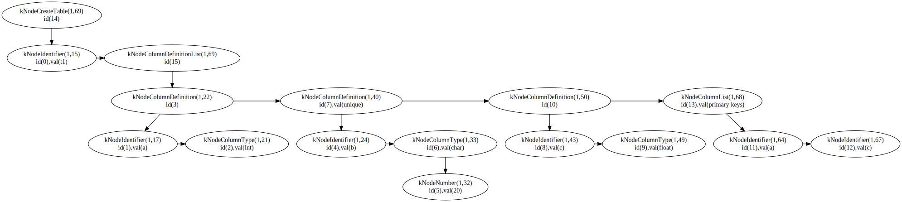
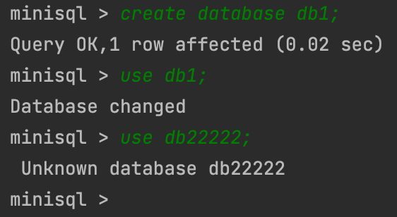

<div class="cover" style="page-break-after:always;font-family:方正公文仿宋;width:100%;height:100%;border:none;margin: 0 auto;text-align:center;">
    <div style="width:60%;margin: 0 auto;height:0;padding-bottom:10%;">
        </br>
        
    </div>
    </br></br></br></br></br>
    <div style="width:60%;margin: 0 auto;height:0;padding-bottom:40%;">
        
	</div>
    </br></br></br></br></br></br></br></br>
    <span style="font-family:华文黑体Bold;text-align:center;font-size:20pt;margin: 10pt auto;line-height:30pt;">《MiniSQL总体设计报告》</span>
    <p style="text-align:center;font-size:14pt;margin: 0 auto">课程作业报告 </p>
    </br>
    </br>
    <table style="border:none;text-align:center;width:72%;font-family:仿宋;font-size:14px; margin: 0 auto;">
    <tbody style="font-family:方正公文仿宋;font-size:12pt;">
    	<tr style="font-weight:normal;"> 
    		<td style="width:20%;text-align:right;">题　　目</td>
    		<td style="width:2%">：</td> 
    		<td style="width:40%;font-weight:normal;border-bottom: 1px solid;text-align:center;font-family:华文仿宋"> MiniSQL总体设计报告</td>     </tr>
    	<tr style="font-weight:normal;"> 
    		<td style="width:20%;text-align:right;">上课时间</td>
    		<td style="width:2%">：</td> 
    		<td style="width:40%;font-weight:normal;border-bottom: 1px solid;text-align:center;font-family:华文仿宋"> 周二下午</td>     </tr>
    	<tr style="font-weight:normal;"> 
    		<td style="width:20%;text-align:right;">授课教师</td>
    		<td style="width:2%">：</td> 
    		<td style="width:40%;font-weight:normal;border-bottom: 1px solid;text-align:center;font-family:华文仿宋">陈刚 </td>     </tr>
    	<tr style="font-weight:normal;"> 
    		<td style="width:20%;text-align:right;">成　　员</td>
    		<td style="width:2%">：</td> 
    		<td style="width:40%;font-weight:normal;border-bottom: 1px solid;text-align:center;font-family:华文仿宋"> 陆天-3180103740</td>     </tr>
    	<tr style="font-weight:normal;"> 
    		<td style="width:20%;text-align:right;">成　　员</td>
    		<td style="width:2%">：</td> 
    		<td style="width:40%;font-weight:normal;border-bottom: 1px solid;text-align:center;font-family:华文仿宋">吕丹瑜-3190101348 </td>     </tr>
    	<tr style="font-weight:normal;"> 
    		<td style="width:20%;text-align:right;">成　　员</td>
    		<td style="width:%">：</td> 
    		<td style="width:40%;font-weight:normal;border-bottom: 1px solid;text-align:center;font-family:华文仿宋"> 林炬乙-3180103721</td>     </tr>
    	<tr style="font-weight:normal;"> 
    		<td style="width:20%;text-align:right;">日　　期</td>
    		<td style="width:2%">：</td> 
    		<td style="width:40%;font-weight:normal;border-bottom: 1px solid;text-align:center;font-family:华文仿宋">完成日期</td>     </tr>
    </tbody>              
    </table>
</div>

<!-- 注释语句：导出PDF时会在这里分页 -->


# **MiniSQL总体设计报告**

## MiniSQL系统概述

### 背景

#### 编写目的

​	设计并实现一个精简型单用户SQL引擎MiniSQL，允许用户通过字符界面输入SQL语句实现基本的增删改查操作，并能够通过索引来优化性能。

#### 项目背景

​	通过对MiniSQL的设计与实现，提高我们对系统编程能力，加深对数据库管理系统底层设计的理解。


###  功能描述

1. 数据类型：要求支持三种基本数据类型：`integer`，`char(n)`，`float`。
2. 表定义：一个表可以定义多达32个属性，各属性可以指定是否为`unique`，支持单属性的主键定义。
3. 索引定义：对于表的主属性自动建立B+树索引，对于声明为`unique`的属性也需要建立B+树索引。
4. 数据操作: 可以通过`and`或`or`连接的多个条件进行查询，支持等值查询和区间查询。支持每次一条记录的插入操作；支持每次一条或多条记录的删除操作。
5. 在工程实现上，使用源代码管理工具（Git-Lab）进行代码管理，代码提交历史和每次提交的信息清晰明确；同时编写的代码应符合代码规范，具有良好的代码风格。


### 运行环境和配置

- `apple clang`: 11.0+ (MacOS)，使用`gcc --version`和`g++ --version`查看
- `gcc`&`g++` : 8.0+ (Linux)，使用`gcc --version`和`g++ --version`查看
- `cmake`: 3.16+ (Both)，使用`cmake --version`查看
- `gdb`: 7.0+ (Optional)，使用`gdb --version`查看
- `flex`& `bison`(暂时不需要安装，但如果需要对SQL编译器的语法进行修改，需要安装）

本组：

- 吕丹瑜-系统：M1架构下的MacOS，环境配置：clang + lldb，Ide：CLion + VS Code
- 陆天：
- 林炬乙：


###   参考资料

1. 语雀文档📖：https://www.yuque.com/yingchengjun/pcp6qx/fggii4
2. 链接🔗：http://db.cs.berkeley.edu/papers/fntdb07-architecture.pdf
3. CMU网课🌲：https://www.bilibili.com/video/BV1VL411w72p?p=5 
3. 本组语雀知识库🦜：https://zg3aga.yuque.com/hbre0c


##    MiniSQL系统结构设计

###  总体设计：

#### 系统架构示意图

- 在系统架构中，解释器`SQL Parser`在解析SQL语句后将生成的语法树交由执行器`Executor`处理。执行器则根据语法树的内容对相应的数据库实例（`DB Storage Engine Instance`）进行操作。
- 每个`DB Storage Engine Instance`对应了一个数据库实例（即通过`CREATE DATABSAE`创建的数据库）。在每个数据库实例中，用户可以定义若干表和索引，表和索引的信息通过`Catalog Manager`、`Index Manager`和`Record Manager`进行维护。目前系统架构中已经支持使用多个数据库实例，不同的数据库实例可以通过`USE`语句切换（即类似于MySQL的切换数据库），在初步实现时，可以先考虑单个数据库实例的场景，在单个实例跑通后再支持多个实例。


### DISK AND BUFFER POOL MANAGER 模块：

​	Disk Manager和Buffer Pool Manager模块位于架构的最底层。Disk Manager主要负责数据库文件中数据页的分配和回收，以及数据页中数据的读取和写入。其中，数据页的分配和回收通过位图（Bitmap）这一数据结构实现，位图中每个比特（Bit）对应一个数据页的分配情况，用于标记该数据页是否空闲（`0`表示空闲，`1`表示已分配）。当Buffer Pool Manager需要向Disk Manager请求某个数据页时，Disk Manager会通过某种映射关系，找到该数据页在磁盘文件中的物理位置，将其读取到内存中返还给Buffer Pool Manager。而Buffer Pool Manager主要负责将磁盘中的数据页从内存中来回移动到磁盘，这使得我们设计的数据库管理系统能够支持那些占用空间超过设备允许最大内存空间的数据库。

​	Buffer Pool Manager中的操作对数据库系统中其他模块是透明的。例如，在系统的其它模块中，可以使用数据页唯一标识符`page_id`向Buffer Pool Manager请求对应的数据页。但实际上，这些模块并不知道该数据页是否已经在内存中还是需要从磁盘中读取。同样地，Disk Manager中的数据页读写操作对Buffer Pool Manager模块也是透明的，即Buffer Pool Manager使用逻辑页号`logical_page_id`向Disk Manager发起数据页的读写请求，但Buffer Pool Manager并不知道读取的数据页实际上位于磁盘文件中的哪个物理页（对应页号`physical_page_id`）。

#### Bitmap （实现一个简单的位图页）

##### 实验概述

位图页是Disk Manager模块中的一部分，是实现磁盘页分配与回收工作的必要功能组件。位图页与数据页一样，占用`PAGE_SIZE`（4KB）的空间，标记一段连续页的分配情况。

Bitmap Page由两部分组成，一部分是用于加速Bitmap内部查找的元信息（Bitmap Page Meta），它可以包含当前已经分配的页的数量（`page_allocated_`）以及下一个空闲的数据页(`next_free_page_`)，元信息所包含的内容可以由同学们根据实际需要自行定义。除去元信息外，页中剩余的部分就是Bitmap存储的具体数据，其大小`BITMAP_CONTENT_SIZE`可以通过`PAGE_SIZE - BITMAP_PAGE_META_SIZE`来计算，自然而然，这个Bitmap Page能够支持最多纪录`BITMAP_CONTENT_SIZE * 8`个连续页的分配情况。


##### 代码实现

Bitmap Page相关的代码位于src/include/page/bitmap_page.h和src/page/bitmap_page.cpp中,	主要实现了以下函数

```cpp
函数接口：
BitmapPage::AllocatePage(&page_offset)：分配一个空闲页，并通过page_offset返回所分配的空闲页位于该段中的下标（从0开始）；
BitmapPage::DeAllocatePage(page_offset)：回收已经被分配的页；
itmapPage::IsPageFree(page_offset)：判断给定的页是否是空闲（未分配）的。
```

#### LRU Replacer（LRU 替换策略）

##### 文档概述

Buffer Pool Replacer负责跟踪Buffer Pool中数据页的使用情况，并在Buffer Pool没有空闲页时决定替换哪一个数据页。在本节中，你需要实现一个基于LRU替换算法的`LRUReplacer`，`LRUReplacer`类在`src/include/buffer/lru_replacer.h`中被定义，其扩展了抽象类`Replacer`（在`src/include/buffer/replacer.h`中被定义）。`LRUReplacer`的大小默认与Buffer Pool的大小相同。

LRU将访问数据的顺序或时间和数据本身维护在一个容器当中。当访问一个数据时：

1. 该数据不在容器当中，则设置该数据的优先级为最高并放入容器中。
2. 该数据在容器当中，则更新该数据的优先级至最高。

当数据的总量达到上限后，则移除容器中优先级最低的数据。

lRU策略最合适的方案是：双向链表+哈希，时间复杂度O(1)

##### 代码实现

相关的代码位于`src/buffer/lru_replacer.cpp`中。

```cpp
函数接口：
LRUReplacer::Victim(*frame_id)：替换（即删除）与所有被跟踪的页相比最近最少被访问的页，将其页帧号（即数据页在Buffer Pool的Page数组中的下标）存储在输出参数`frame_id`中输出并返回`true`，如果当前没有可以替换的元素则返回`false`；
LRUReplacer::Pin(frame_id)：将数据页固定使之不能被`Replacer`替换，即从`lru_list_`中移除该数据页对应的页帧。`Pin`函数应当在一个数据页被Buffer Pool Manager固定时被调用；
LRUReplacer::Unpin(frame_id)`：将数据页解除固定，放入`lru_list_`中，使之可以在必要时被`Replacer`替换掉。`Unpin`函数应当在一个数据页的引用计数变为`0`时被Buffer Pool Manager调用，使页帧对应的数据页能够在必要时被替换；
  LRUReplacer::Size()：此方法返回当前`LRUReplacer`中能够被替换的数据页的数量。
  
结构：
  private:
  deque<frame_id_t>lru_list;
  size_t size=0;
  unordered_map<frame_id_t,std::deque<frame_id_t>::iterator> replacer;
```

### RECORD MANAGER 模块：

​	Record Manager负责管理数据表中所有的记录，它能够支持记录的插入、删除与查找操作，并对外提供相应的接口。

与记录（Record）相关的概念有以下几个：

- 列（`Column`）：在`src/include/record/column.h`中被定义，用于定义和表示数据表中的某一个字段，即包含了这个字段的字段名、字段类型、是否唯一等等；
- 模式（`Schema`）：在`src/include/record/schema.h`中被定义，用于表示一个数据表或是一个索引的结构。一个`Schema`由一个或多个的`Column`构成；
- 域（`Field`）：在`src/include/record/field.h`中被定义，它对应于一条记录中某一个字段的数据信息，如存储数据的数据类型，是否是空，存储数据的值等等；
- 行（`Row`）：在`src/include/record/row.h`中被定义，与元组的概念等价，用于存储记录或索引键，一个`Row`由一个或多个`Field`构成。

#### Record and Schema(记录与模式)

##### 实验概述

​	有关数据的序列化和反序列化操作的任务。为了能够持久化存储上面提到的`Row`、`Field`、`Schema`和`Column`对象，我们需要提供一种能够将这些对象序列化成字节流（`char*`）的方法，以写入数据页中。与之相对，为了能够从磁盘中恢复这些对象，我们同样需要能够提供一种反序列化的方法，从数据页的`char*`类型的字节流中反序列化出我们需要的对象。总而言之，序列化和反序列化操作实际上是将数据库系统中的对象（包括记录、索引、目录等）进行内外存格式转化的过程，前者将内存中的逻辑数据（即对象）通过一定的方式，转换成便于在文件中存储的物理数据，后者则从存储的物理数据中恢复出逻辑数据，两者的目的都是为了实现数据的持久化。

​	为了确保数据能够正确存储，`Row`、`Schema`和`Column`对象中都引入了魔数`MAGIC_NUM`，它在序列化时被写入到字节流的头部并在反序列化中被读出以验证我们在反序列化时生成的对象是否符合预期。

​	完善`Row`、`Schema`和`Column`对象各自的`SerializeTo`、`DeserializeFrom`和`GetSerializedSize`方法，具体以何种方式进行序列化（即需要序列化类中的哪些数据）由你自行决定，我们在测试代码中只会验证序列化前后的对象是否匹配。

​	其中，`SerializeTo`和`DeserializeFrom`函数的返回值为`uint32_t`类型，它表示在序列化和反序列化过程中`buf`指针向前推进了多少个字节。

​	对于`Row`类型对象的序列化，可以通过位图的方式标记为`null`的`Field`(即 *Null Bitmaps*)，对于`Row`类型对象的反序列化，在反序列化每一个`Field`时，需要将自身的`heap_`作为参数传入到`Field`类型的`Deserialize`函数中，这也意味着所有反序列化出来的`Field`的内存都由该`Row`对象维护。对于`Column`和`Schema`类型对象的反序列化，将使用`MemHeap`类型的对象`heap`来分配空间，分配后新生成的对象于参数`column`和`schema`中返回

##### 个人理解

总体思路：通过将Column、Row、Schema中包含的数据转换成char字符串流存储进行序列化，反序列化就是相应的将序列化的内容恢复成原样。在本次开发中，我们可以根据框架所提供的宏（感谢ycj dl）进行类型转换，但要注意的是每次读入数据之后要将相应的buf指针往后推，去读入之后的内容。

​	需要注意的是存储string信息的时候，需要额外记录string的长度(以及char数组末尾需要加'\0'，否则容易出现乱码)

##### 代码实现

相关实现代码在：`src/include/record/row.h`、 `src/record/row.cpp`、 `src/include/record/schema.h`、 `src/record/schema.cpp`、 `src/include/record/column.h`、 `src/record/column.cpp`的文件中

```cpp
函数接口：
Row::SerializeTo(*buf, *schema)；将Row序列化成char字符串流保存在buf
Row::DeserializeFrom(*buf, *schema)；将buf反序列化成Row
Row::GetSerializedSize(*schema)；得到Row序列化之后的长度
Column::SerializeTo(*buf)；将Column序列化成char字符串流保存在buf
Column::DeserializeFrom(*buf, *&column, *heap)；将buf反序列化成Column
Column::GetSerializedSize()；得到Column序列化之后的长度
Schema::SerializeTo(*buf)；将Schema序列化成char字符串流保存在buf
Schema::DeserializeFrom(*buf, *&schema, *heap)；将buf反序列化成Schema
Schema::GetSerializedSize()；得到Schema序列化之后的长度
```

#### Table Heap(堆表)

##### 实验概述

​	堆表（`TableHeap`，相关定义在`src/include/storage/table_heap.h`）是一种将记录以无序堆的形式进行组织的数据结构，不同的数据页（`TablePage`）之间通过双向链表连接。堆表中的记录通过`RowId`进行定位。`RowId`记录了该行记录所在的`page_id`和`slot_num`，其中`slot_num`用于定位记录在这个数据页中的下标位置。

​	堆表中的每个数据页（与课本中的`Slotted-page Structure`给出的结构基本一致，见下图，能够支持存储不定长的记录）都由表头（Table Page Header）、空闲空间（Free Space）和已经插入的数据（Inserted Tuples）三部分组成，与之相关的代码位于`src/include/page/table_page.h`中，表头在页中从左往右扩展，记录了`PrevPageId`、`NextPageId`、`FreeSpacePointer`以及每条记录在`TablePage`中的偏移和长度；插入的记录在页中从右向左扩展，每次插入记录时会将`FreeSpacePointer`的位置向左移动。


​	当向堆表中插入一条记录时，一种简单的做法是，沿着`TablePage`构成的链表依次查找，直到找到第一个能够容纳该记录的`TablePage`（*First Fit* 策略）。当需要从堆表中删除指定`RowId`对应的记录时，框架中提供了一种逻辑删除的方案，即通过打上Delete Mask来标记记录被删除，在之后某个时间段再从物理意义上真正删除该记录（本节中需要完成的任务之一）。对于更新操作，需要分两种情况进行考虑，一种是`TablePage`能够容纳下更新后的数据，另一种则是`TablePage`不能够容纳下更新后的数据，前者直接在数据页中进行更新即可，后者的实现方式留给同学们自行思考。此外，在堆表中还需要实现迭代器`TableIterator`以便上层模块遍历堆表中的所有记录。

##### 个人理解

总体思路：通过table_heap实现对tuple的Insert、Delete、Update等操作。因为已经实现了page中对tuple的相应的操作，所以这里有关的操作只需要通过rid找到相应的/合适的page（利用buffer_pool_manager对其fetch，之后使用完毕之后需要调用Unping），再调用page中的操作函数。

需要注意的是Update操作：在出现没找到相应tuple的时候返回false；如果找到了tuple但是当前page已经没有足够的空间可以存放更新的tuple的时候，我采用的是删除当前已存在的old tuple（markdelte之后applydelete），之后插入新的tuple。

##### 代码实现

相关代码在`src/include/storage/table_heap.h`、 `src/storage/table_heap.cpp`、 `test/record/tuple_test.cpp`、`src/include/storage/table_iterator.h`	、`src/storage/table_iterator.cpp`中

```cpp
函数接口：
TableHeap::InsertTuple(&row,*txn)：向堆表中插入一条记录，插入记录后生成RowId需要通过row对象返回；
TableHeap::UpdateTuple(&new_row, &rid, *txn)：将RowId为rid的记录old_row替换成新的记录new_row，并将new_row的RowId通过new_row.rid_返回；
TableHeap::ApplyDelete(&rid, *txn)：从物理意义上删除这条记录；
TableHeap::GetTuple(*row, *txn)：获取RowId为row->rid_的记录；
TableHeap::FreeHeap()：销毁整个TableHeap并释放这些数据页；
TableHeap::Begin()：获取堆表的首迭代器；
TableHeap::End()：获取堆表的尾迭代器;

迭代器部分函数接口：
TableIterator::operator++():移动到下一条记录，通过++iter调用；
TableIterator::operator++(int):移动到下一条记录，通过iter++调用;
```

### INDEX MANAGER 模块：

​	Index Manager 负责数据表索引的实现和管理，包括：索引的创建和删除，索引键的等值查找，索引键的范围查找（返回对应的迭代器），以及插入和删除键值等操作，并对外提供相应的接口。

​	在上一个实验中，同学们应该能够发现，通过遍历堆表的方式来查找一条记录是十分低效的。为了能够快速定位到某条记录而无需搜索数据表中的每一条记录，我们需要在上一个实验的基础上实现一个索引，这能够为快速随机查找和高效访问有序记录提供基础。索引有很多种实现方式，如B+树索引，Hash索引等等。在本实验中，需实现一个基于磁盘的B+树动态索引结构。

#### BPlusTreePage

##### 实验概述

`BPlusTreePage`是`BPlusTreeInternalPage`和`BPlusTreeLeafPage`类的公共父类，它包含了中间结点和叶子结点共同需要的数据：

- `page_type_`: 标记数据页是中间结点还是叶子结点；
- `lsn_`: 数据页的日志序列号，目前不会用到，如果之后感兴趣做Crash Recovery相关的内容需要用到；
- `size_`: 当前结点中存储Key-Value键值对的数量；
- `max_size_`: 当前结点最多能够容纳Key-Value键值对的数量；
- `parent_page_id_`: 父结点对应数据页的`page_id`;
- `page_id_`: 当前结点对应数据页的`page_id`。

##### 个人理解

主要就是内部调用结构体private的数据。

##### 代码实现

代码实现在

- `src/include/storage/page/b_plus_tree_page.h`
- `src/page/b_plus_tree_page.cpp`

```cpp 
函数接口:
  bool IsLeafPage() const;
  bool IsRootPage() const;
  void SetPageType(IndexPageType page_type);
  int GetSize() const;
  void SetSize(int size);
  void IncreaseSize(int amount);
  int GetMaxSize() const;
  void SetMaxSize(int max_size);
  int GetMinSize() const;
  page_id_t GetParentPageId() const;
  void SetParentPageId(page_id_t parent_page_id);
  page_id_t GetPageId() const;
  void SetPageId(page_id_t page_id);
  void SetLSN(lsn_t lsn = INVALID_LSN);
```


####  BPlusTreeInternalPage

##### 实验概述

​	中间结点`BPlusTreeInternalPage`不存储实际的数据，它只按照顺序存储个键和个指针（这些指针记录的是子结点的`page_id`）。由于键和指针的数量不相等，因此我们需要将第一个键设置为INVALID，也就是说，顺序查找时需要从第二个键开始查找。在任何时候，每个中间结点至少是半满的（Half Full）。当删除操作导致某个结点不满足半满的条件，需要通过合并（Merge）相邻两个结点或是从另一个结点中借用（移动）一个元素到该结点中（Redistribute)来使该结点满足半满的条件。当插入操作导致某个结点溢出时，需要将这个结点分裂成为两个结点。

​	Note: 为了便于理解和设计，我们将键和指针以`pair`的形式顺序存储，但由于键和指针的数量不一致，我们不得已牺牲一个键的空间，将其标记为INVALID。对于B+树的每一个中间结点，我们都付出了一个键的空间代价。实际上有一种更为精细的设计选择：定义一个大小为的数组连续存放键，然后定义一个大小为的数组连续存放指针，这样设计的好处在于，一是没有空间上的浪费，二是在键值查找时CPU缓存的命中率较高（局部性原理)

#### BPlusTreeLeafPage

##### 实验概述

叶结点`BPlusTreeLeafPage`存储实际的数据，它按照顺序存储个键和个值，其中键由一个或多个`Field`序列化得到（参考#3.2.4)，在`BPlusTreeLeafPage`类中用模板参数`KeyType`表示；值实际上存储的是`RowId`的值，它在`BPlusTreeLeafPage`类中用模板参数`ValueType`表示。叶结点和中间结点一样遵循着键值对数量的约束，同样也需要完成对应的合并、借用和分裂操作。

需要在`src/include/storage/page/b_plus_tree_leaf_page.h`和`src/page/b_plus_tree_leaf_page.cpp`中实现`BPlusTreeLeafPage`类。

##### 个人理解

在比较Key的时候，我一开始采取的是遍历，时间复杂度为O(N)，改为二分可以大大优化效率，时间复杂度降低为O(N)

##### 代码实现

函数实现在

- `src/include/storage/page/b_plus_tree_internal_page.h`
- `src/storage/page/b_plus_tree_internal_page.cpp`

```cpp
函数接口：
	KeyType KeyAt(int index) const;
  void SetKeyAt(int index, const KeyType &key);
  void SetValueAt(int index, const ValueType &value);
  int ValueIndex(const ValueType &value) const;
  ValueType ValueAt(int index) const;
  ValueType Lookup(const KeyType &key, const KeyComparator &comparator) const;
  void PopulateNewRoot(const ValueType &old_value, const KeyType &new_key, const ValueType &new_value);
  int InsertNodeAfter(const ValueType &old_value, const KeyType &new_key, const ValueType &new_value);
  void Remove(int index);
  ValueType RemoveAndReturnOnlyChild();
  // Split and Merge utility methods
  void MoveAllTo(BPlusTreeInternalPage *recipient, const KeyType &middle_key, BufferPoolManager *buffer_pool_manager);
  void MoveHalfTo(BPlusTreeInternalPage *recipient, BufferPoolManager *buffer_pool_manager);
  void MoveFirstToEndOf(BPlusTreeInternalPage *recipient, const KeyType &middle_key,BufferPoolManager *buffer_pool_manager);
  void MoveLastToFrontOf(BPlusTreeInternalPage *recipient, const KeyType &middle_key,BufferPoolManager *buffer_pool_manager);
private:
  void CopyNFrom(MappingType *items, int size, BufferPoolManager *buffer_pool_manager);
  void CopyLastFrom(const MappingType &pair, BufferPoolManager *buffer_pool_manager);
  void CopyFirstFrom(const MappingType &pair, BufferPoolManager *buffer_pool_manager);

```

#### KeyType、ValueType & KeyComparator

在B+树的数据页以及索引中，考虑到索引键类型可能会不同（对不同长度的索引键使用不同的索引键类型，如为最大长度不超过32字节的索引键使用`GenericKey<32>`（在`src/include/index/generic_key.h`中定义），为最大长度不超过64字节的索引键使用`GenericKey<64>`等等）、值类型也可能不同（叶结点存储`RowId`，而非叶结点存储`page_id`）、对应的比较方式也有可能不同（如对`GenericKey<32>`使用`GenericComparator<32>`进行比较），因此我们使用模板对`BPlusTreeLeafPage`、 `BPlusTreeLeafPage`等类进行定义。

这部分由框架实现。

### CATALOG MANAGER 模块：

​	Catalog Manager 负责管理和维护数据库的所有模式信息，包括：

- 数据库中所有表的定义信息，包括表的名称、表中字段（列）数、主键、定义在该表上的索引。
- 表中每个字段的定义信息，包括字段类型、是否唯一等。
- 数据库中所有索引的定义，包括所属表、索引建立在那个字段上等。

这些模式信息在被创建、修改和删除后还应被持久化到数据库文件中。此外，Catalog Manager还需要为上层的执行器Executor提供公共接口以供执行器获取目录信息并生成执行计划。

### SQL EXECUTOR 模块：

Executor（执行器）的主要功能是根据解释器（Parser）生成的语法树，通过Catalog Manager 提供的信息生成执行计划，并调用 Record Manager、Index Manager 和 Catalog Manager 提供的相应接口进行执行，最后通过执行上下文`ExecuteContext`将执行结果返回给上层模块。

#### 实验概述

**语法树数据结构**：以下是语法树（结点）的数据结构定义，每个结点都包含了一个唯一标识符`id_`，唯一标识符在调用`CreateSyntaxNode`函数时生成（框架中已经给出实现）。`type_`表示语法树结点的类型，`line_no_`和`col_no_`表示该语法树结点对应的是SQL语句的第几行第几列，`child_`和`next_`分别表示该结点的子结点和兄弟结点，`val_`用作一些额外信息的存储（如在`kNodeString`类型的结点中，`val_`将用于存储该字符串的字面量）。

```cpp
/**
 * Syntax node definition used in abstract syntax tree.
 */
struct SyntaxNode {
  int id_;    /** node id for allocated syntax node, used for debug */
  SyntaxNodeType type_; /** syntax node type */
  int line_no_; /** line number of this syntax node appears in sql */
  int col_no_;  /** column number of this syntax node appears in sql */
  struct SyntaxNode *child_;  /** children of this syntax node */
  struct SyntaxNode *next_;   /** siblings of this syntax node, linked by a single linked list */
  char *val_; /** attribute value of this syntax node, use deep copy */
};
typedef struct SyntaxNode *pSyntaxNode;
```

#### 个人理解

该模块主要的工作分为三部分：

- 扒语法树获取信息
- 调用上层接口
- 出现bug极有可能是之前的问题，需要及时修复之前的bug

#### 代码实现

##### 图形化输出

通过printf无法直接输出完备的表格，于是我封装了输出表格的函数，方便之后执行的时候调用。如下

```cpp
// 画行线
void ExecuteEngine::Draw_line(vector<int> max, int columns)；
}

//画表格
void ExecuteEngine::Draw_Data(vector<int> max, vector<vector<string>> str, vector<string> head, int columns, int row)；
```

##### Database

create database

```cpp
dberr_t ExecuteEngine::ExecuteCreateDatabase(pSyntaxNode ast, ExecuteContext *context)；
```

##### Table

```cpp
create table t1(a int, b char(20) unique, c float, primary key(a, c));
```



```cpp
需要注意的是在创建表时，不仅要对primary key建立索引，还要对unique的属性建立索引
在创建表的时候自动生成index
- unique会生成单个索引
- primarykey也会生成相应的索引
```

```cpp
dberr_t ExecuteEngine::ExecuteCreateTable(pSyntaxNode ast, ExecuteContext *context)；
```

##### Index

```cpp
create index idx01 on account(name)
```


```cpp
dberr_t ExecuteEngine::ExecuteShowIndexes(pSyntaxNode ast, ExecuteContext *context)；
```

##### Condition获取

在select、Update、Drop的执行中都需要对条件进行提取，主要就是扒语法树，获取其中的条件节点。

为了方便组员编写之后的增删改查操作，我封装了以下函数便于其调用，免去每次分析语法树的苦恼。

###### GetSingleCondition

单个Condition获取，传入kNodeCompareOperator

```cpp
  vector<string> GetSingleCondition(SyntaxNode* node){
    ASSERT(node->type_ == kNodeCompareOperator,"ERROR: Can't get condition");
```

###### GetAllConditions

需要：传入的node种类为kNodeConditions , conditions 为获取到条件的容器。

or作为connect-condition的分割，采取的方法是遍历语法树的child的节点，将新的connect放至vector尾部，同时其next为operator节点，可以生成的新的condition，压入condition的那个vecotr尾部。

```cpp
void ExecuteEngine::GetAllConditions(SyntaxNode* node,vector<vector<vector<string>>> & conditions)；

```

## 测试方案和测试样例

### DISK AND BUFFER POOL MANAGER 模块

#### Bitmap


#### LRU Replacer


### RECORD MANAGER 

#### Record and Schema

#### Database操作

##### 初始状态


##### 创建database


##### 删除database


##### 使用database



#### Table操作

##### 未指定使用的database


##### 创建table


##### 删除table


#### 索引

##### show index

create table t3(a int unique,b char(20),c int ,primary key (c));


##### create index


##### drop index


#### GetSingleCondition

`where b = 1;`

返回的结果是：


`where a not null;`


#### GetAllConditions

 `update t1 set a=1 where a=1 and b=1 and c=1 or d=1;`


## 分组与设计分工

### 本组协同开发流程

对于代码的同步管理采用ZJU Git：https://git.zju.edu.cn/3180103721/minisql

交流主要以线上为主：微信沟通、腾讯&钉钉视频会议、以及有一次线下debug活动

本组气氛融洽，沟通较多，学习多多。


### MiniSQL时间安排


### 分工

#### 模块一：DISK AND BUFFER POOL MANAGER (合作)


#### 模块二：RECORD MANAGER(个人)

负责：吕丹瑜

#### 模块三：INDEX MANAGER（合作）


#### 模块四：CATALOG MANAGER(个人)

负责：陆天

#### 模块五：SQL EXECUTOR（合作）


## 本组特色


## 建议

### 吕丹瑜	

​	这是课程组第一次采用框架让我们编写数据库，之前在寒假就听说了CMU的database课程大作业很好，没想到如今能用上ZJU专属的MiniSQL框架。但是该框架也存在着一些问题，比如单测运行检测的不够全面，第二个是如果是作为小组作业分工的话会比较难办，因为之后的模块的同学需要依赖于前面的同学，协同开发是一个难点，可能更好的方法是一个人做完全部，才会对整个框架十分熟悉，但那样子的话工作量又比较大了。然后，针对第五模块的指导比较少，在写的时候会比较懵逼，建议之后增加对第五模块的指导。

